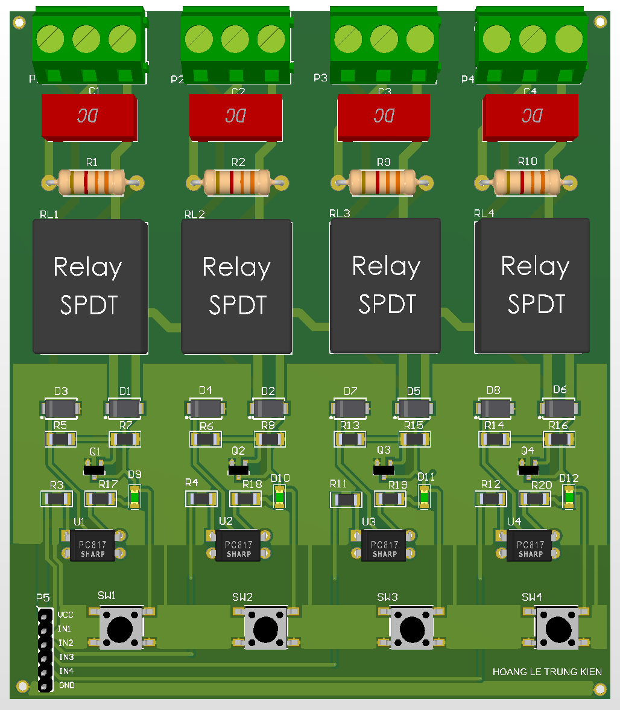

# 4-Channel Relay Module

Optically isolated relay board.

## Function
Switches high-voltage loads.

## Key Specifications
- Opto: PC817
- Relay: SPDT 12V
- Driver: AO3400
- Power: JD-VCC isolation

## Hardware Preview

---
Designed by HOANG LE TRUNG KIEN
